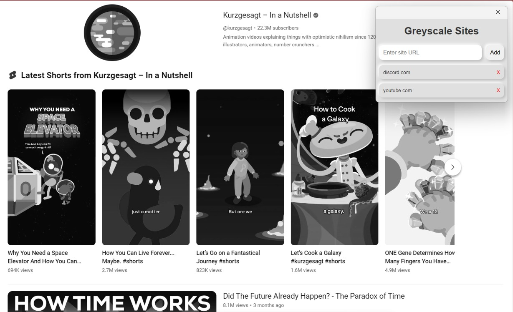

# Greyscale-sites
Selectively grayscale sites to make the internet less addicting  
To install the extension, download this repo, go to your "manage extensions" page on any chromium browser, turn on developer mode if it's not already on, click "load unpacked", and upload the `Greyscale_chrome` folder.  

